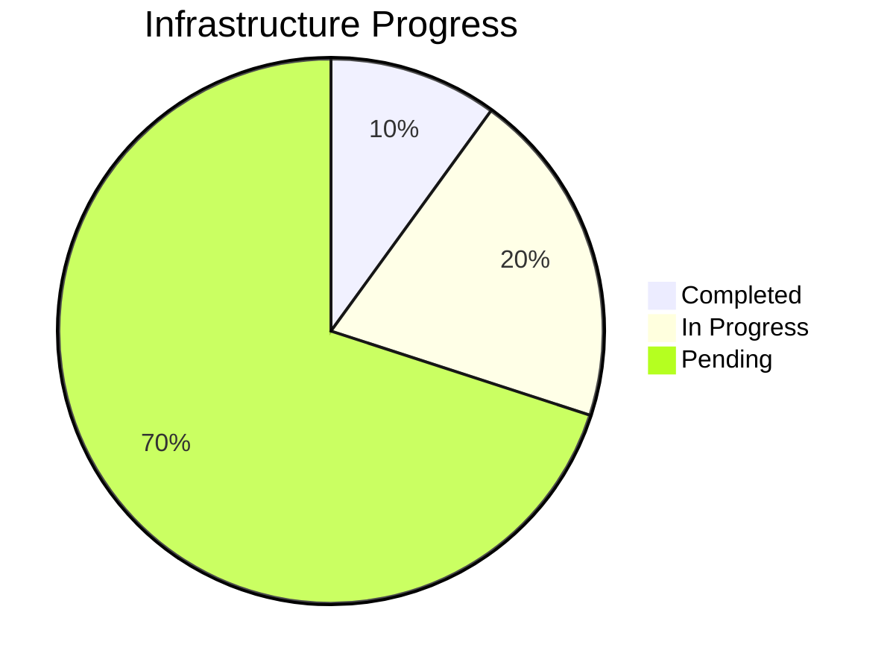
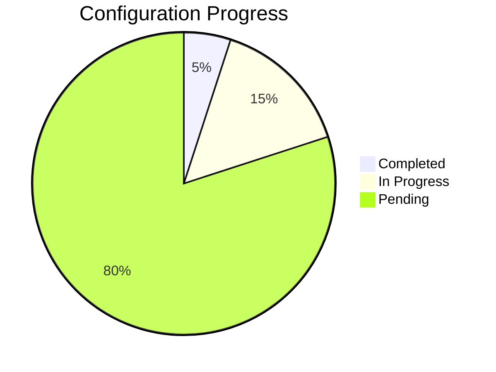
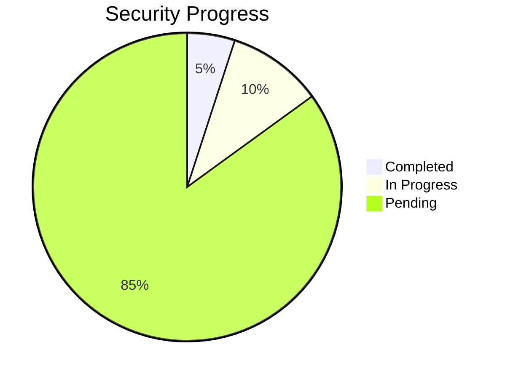
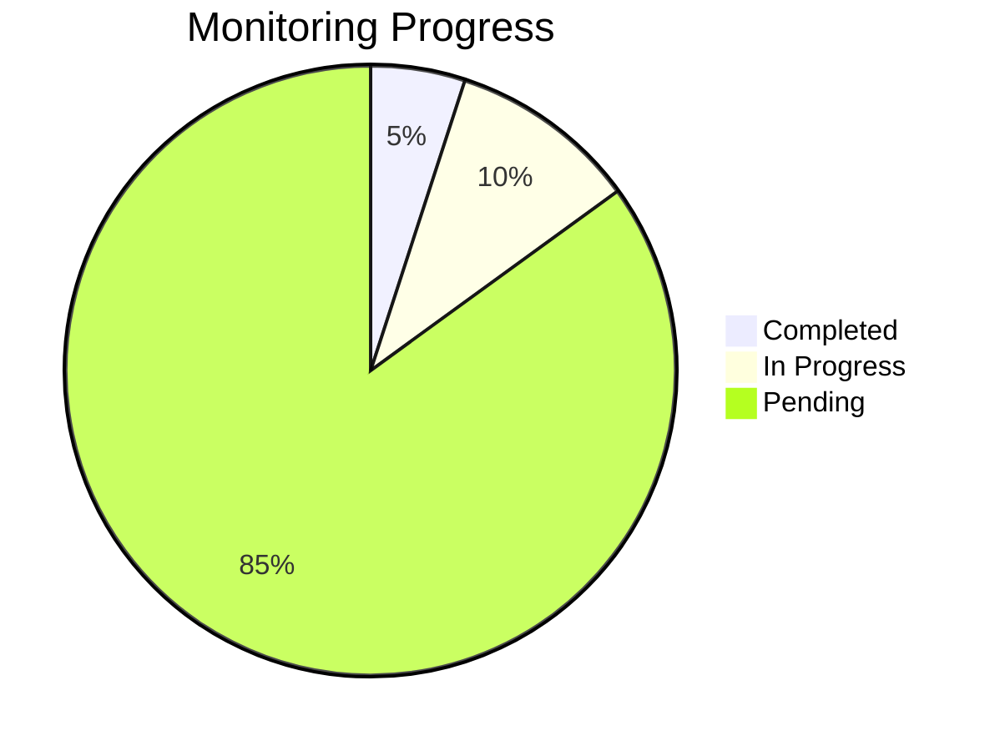

# Progress Tracking

## What Works
1. Project Foundation
   - ✅ Project brief established
   - ✅ Memory bank structure initialized
   - ✅ Core documentation created

2. Documentation
   - ✅ Project overview and goals defined
   - ✅ System architecture documented
   - ✅ Technical context established
   - ✅ Active context tracked

## What's Left to Build

### Phase 1: Infrastructure Foundation
- [ ] Initialize Terraform project structure
- [ ] Set up Cloud Foundation Fabric integration
- [ ] Create base GCP project configuration
- [ ] Establish state management
- [ ] Define core modules

### Phase 2: Configuration Management
- [ ] Create Ansible directory structure
- [ ] Define base roles
- [ ] Set up inventory management
- [ ] Create initial playbooks
- [ ] Implement configuration validation

### Phase 3: Security Implementation
- [ ] Set up secrets management
- [ ] Configure IAM roles and policies
- [ ] Implement network security
- [ ] Set up audit logging
- [ ] Create security validation checks

### Phase 4: Monitoring Setup
- [ ] Configure Stackdriver integration
- [ ] Define key metrics
- [ ] Set up alerting rules
- [ ] Create dashboards
- [ ] Implement cost monitoring

## Current Status

### Infrastructure

### Configuration

### Security

### Monitoring

## Known Issues
1. Initial Setup
   - No current issues

2. Infrastructure
   - Pending implementation

3. Configuration
   - Pending implementation

4. Security
   - Pending implementation

5. Monitoring
   - Pending implementation

## Project Evolution

### Decision History
1. Initial Setup (Current)
   - Selected Cloud Foundation Fabric as base
   - Chose Ansible for configuration
   - Selected Stackdriver for monitoring

### Upcoming Decisions
1. Infrastructure
   - Module structure
   - Environment separation
   - State management approach

2. Configuration
   - Role organization
   - Playbook structure
   - Inventory management

3. Security
   - Secret management solution
   - Network security design
   - IAM structure

4. Monitoring
   - Alert thresholds
   - Dashboard layout
   - Cost monitoring rules
