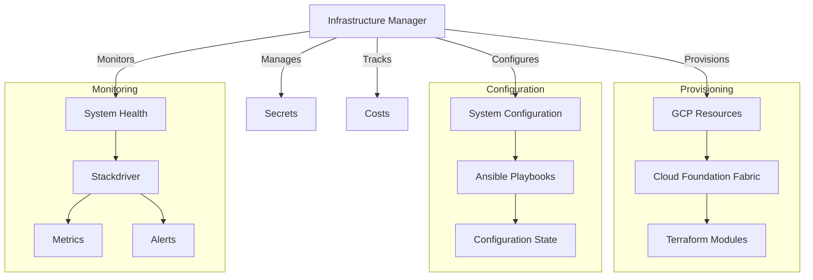
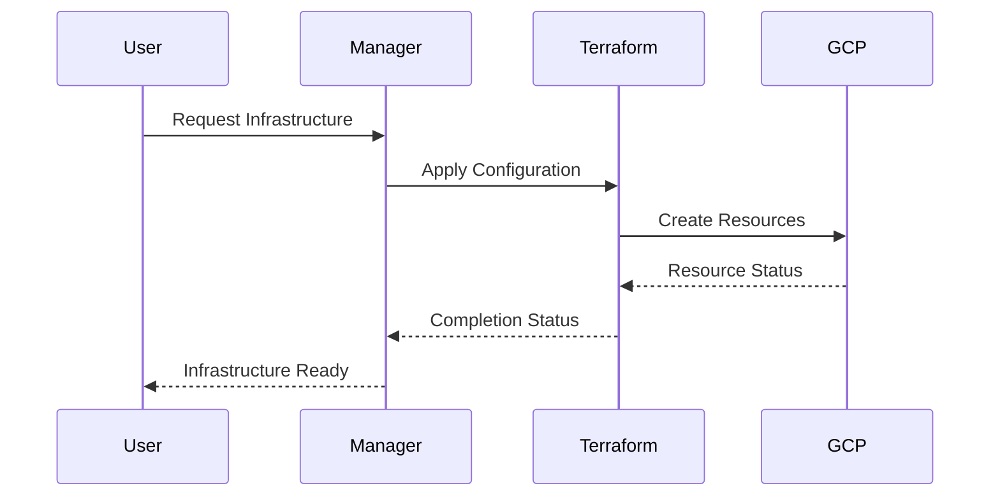
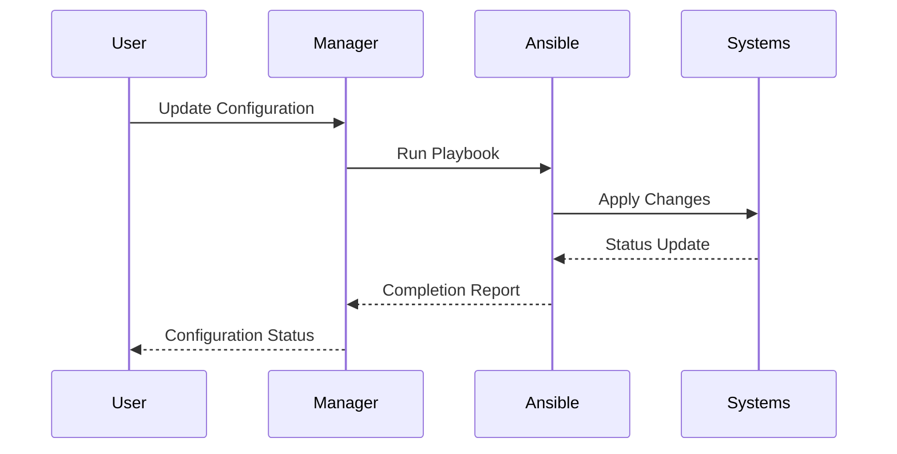

# System Patterns

## Architecture Overview

## Key Technical Decisions

### 1. Infrastructure as Code (IaC)
- Terraform as primary IaC tool
- Cloud Foundation Fabric for standardized GCP setup
- Version controlled infrastructure definitions
- Modular infrastructure components

### 2. Configuration Management
- Ansible for system configuration
- Idempotent configuration changes
- Role-based configuration organization
- Configuration validation checks

### 3. Secrets Management
- Secure secrets storage
- Access control integration
- Automated secret rotation
- Audit logging for secret access

### 4. Monitoring Strategy
- Stackdriver integration
- Critical metrics tracking
- Alert thresholds
- Performance monitoring

### 5. Cost Management
- Resource tagging strategy
- Cost allocation tracking
- Budget alerts
- Usage optimization recommendations

## Design Patterns

### 1. Infrastructure Modules
- Reusable infrastructure components
- Standardized module interface
- Versioned module releases
- Documentation requirements

### 2. Configuration Roles
- Atomic configuration units
- Role dependencies
- Role validation
- Configuration testing

### 3. Security Patterns
- Least privilege access
- Network isolation
- Security group management
- Compliance monitoring

## Implementation Paths

### 1. Infrastructure Provisioning

### 2. Configuration Management

## Critical Paths

### 1. Resource Creation
1. Validate requirements
2. Generate Terraform configs
3. Plan changes
4. Apply infrastructure
5. Verify deployment

### 2. Configuration Updates
1. Validate configuration
2. Generate playbook
3. Test changes
4. Apply configuration
5. Verify state

### 3. Monitoring Setup
1. Define metrics
2. Configure alerts
3. Set up dashboards
4. Validate monitoring
5. Enable notifications
