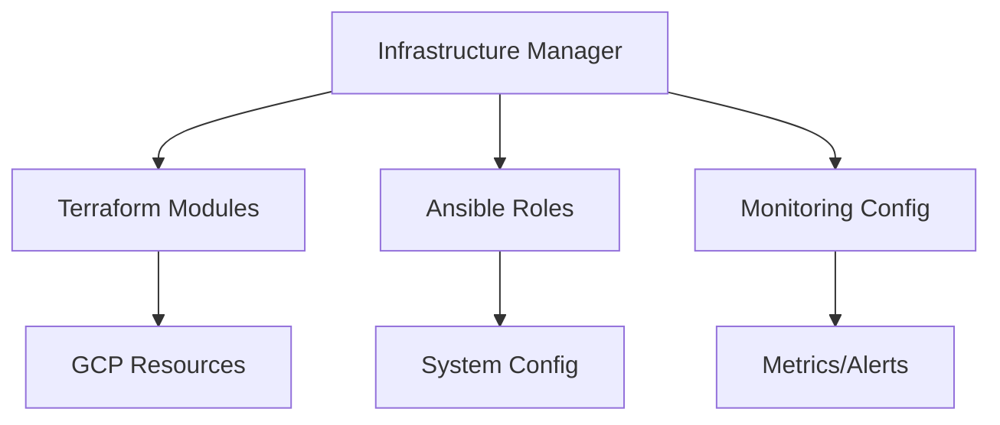

# Technical Context

## Technology Stack

### Core Technologies
1. **Terraform**
   - Version: Latest stable
   - Purpose: Infrastructure provisioning
   - Key Features:
     - State management
     - Resource graphs
     - Provider ecosystem

2. **Cloud Foundation Fabric**
   - Source: [GitHub Repository](https://github.com/ZcashFoundation/cloud-foundation-fabric)
   - Purpose: GCP infrastructure templates
   - Key Components:
     - Network layouts
     - Service configurations
     - Security policies

3. **Ansible**
   - Version: Latest stable
   - Purpose: Configuration management
   - Key Features:
     - Idempotent execution
     - Role-based configs
     - Inventory management

4. **Stackdriver**
   - Purpose: Monitoring and logging
   - Components:
     - Metrics
     - Logs
     - Alerts

## Development Setup

### Required Tools
1. **Local Development**
   - Terraform CLI
   - Ansible CLI
   - GCP SDK
   - Git

2. **Cloud Requirements**
   - GCP Project
   - Service Account
   - API Enablement

### Environment Configuration
1. **Authentication**
   ```bash
   # Service account setup
   export GOOGLE_APPLICATION_CREDENTIALS="path/to/service-account.json"
   
   # Project configuration
   export PROJECT_ID="your-project-id"
   export REGION="your-region"
   ```

2. **Tool Configuration**
   ```bash
   # Terraform backend
   terraform {
     backend "gcs" {
       bucket = "terraform-state"
       prefix = "infra"
     }
   }
   
   # Ansible inventory
   inventory = "inventory.gcp.yml"
   ```

## Technical Constraints

### 1. Infrastructure
- GCP-specific implementations
- Terraform state management
- Resource naming conventions
- Network architecture limitations

### 2. Configuration
- Ansible host requirements
- Configuration update patterns
- Role dependencies
- Inventory management

### 3. Security
- IAM restrictions
- Network security boundaries
- Compliance requirements
- Secret management limitations

### 4. Monitoring
- Stackdriver metric limits
- Alert thresholds
- Log retention policies
- Dashboard constraints

## Dependencies

### 1. External Services
- Google Cloud Platform
  - Compute Engine
  - Cloud Storage
  - Cloud IAM
  - Stackdriver

### 2. Internal Components


### 3. Development Dependencies
- terraform >= 1.0.0
- ansible >= 2.9
- python >= 3.8
- gcloud SDK

## Tool Usage Patterns

### 1. Infrastructure Management
```bash
# Initialize
terraform init

# Plan changes
terraform plan -var-file=env.tfvars

# Apply changes
terraform apply -var-file=env.tfvars
```

### 2. Configuration Management
```bash
# Check syntax
ansible-playbook playbook.yml --syntax-check

# Run playbook
ansible-playbook playbook.yml -i inventory.gcp.yml
```

### 3. Monitoring
```bash
# View metrics
gcloud monitoring metrics list

# Create alert
gcloud alpha monitoring policies create
```

### 4. Cost Management
```bash
# Export billing data
gcloud billing export bq --project_id=$PROJECT_ID

# View current costs
gcloud billing accounts list
